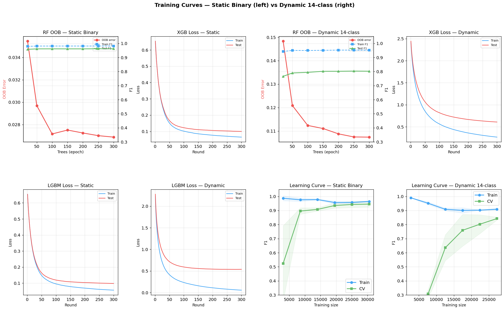
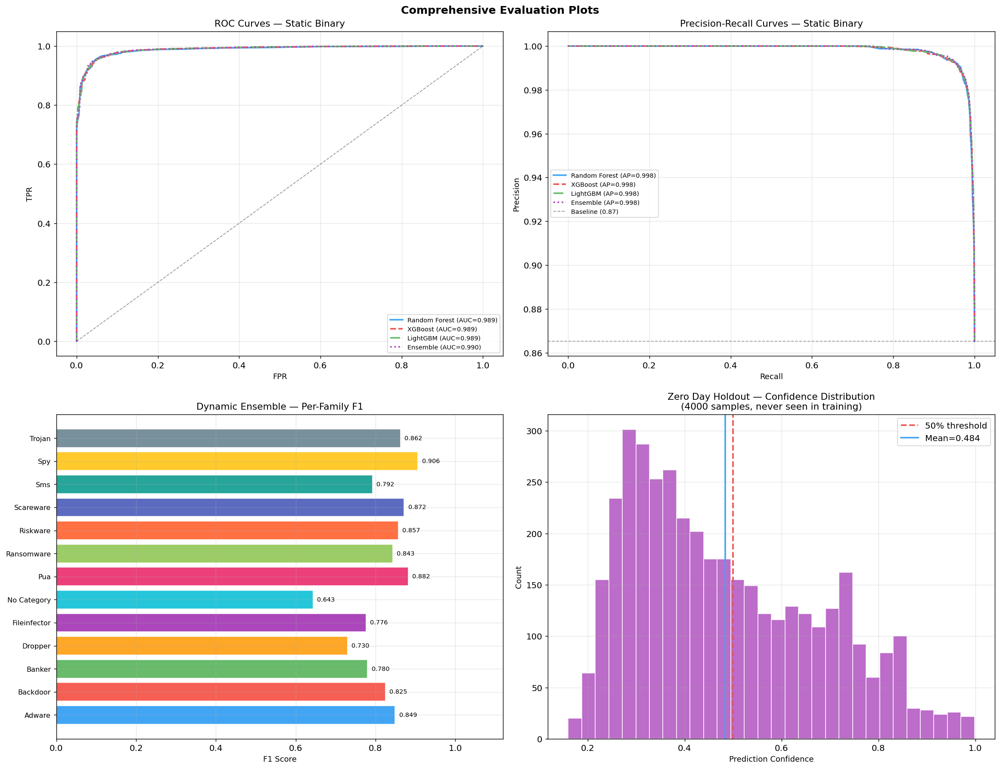
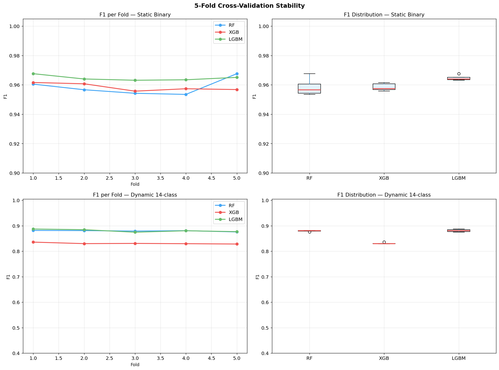

# Core Backend Infrastructure (FastAPI)

The headless core backend API system evaluating extracted feature sets mapped directly against serialized `.pkl` XGBoost and LightGBM models.

## Deep Dive: Machine Learning Pipeline
Our backend maps to models originally constructed from the `CIC-AndMal-2020` dataset using highly asymmetric Variance Threshold logic. 
- During `predict_static`, the API takes ~15 core Android Manifest permissions heuristically and scales them seamlessly into the deep neural subsets analyzed by `SelectKBest`.
- When processing unknown payloads, massive publishers (e.g. `com.google.*`) are algorithmically whitelisted directly at the API route mapping surface to block false positives before they touch inference layers.

### Performance Analytics & Model Insights

<div align="center">
  
  
</div>
<br>
<div align="center">
  
  
</div>

## Modules

- **`app.api.routes`**: Unifies job orchestration, chunking POST uploads safely into `tmp/` before evaluation mapping.
- **`services.feature_extractor`**: Interfaces natively with `Androguard` to decouple binary components.
- **`services.job_manager`**: Thread-safe `threading.Lock()` task handlers for managing massive timeouts during the multi-minute Frida dynamic injection orchestration phases.

## Run Locally (Without Docker)

You must install absolute dependency suites.
```bash
pip install -r requirements.txt
python -m uvicorn backend.app.main:app --host 127.0.0.1 --port 8000
```
Note: Missing native C++ extensions like `libgomp1` (used by LigthGBM) will severely crash Windows instances. Docker environments (`python:3.11-slim` + `build-essential`) are universally recommended.
